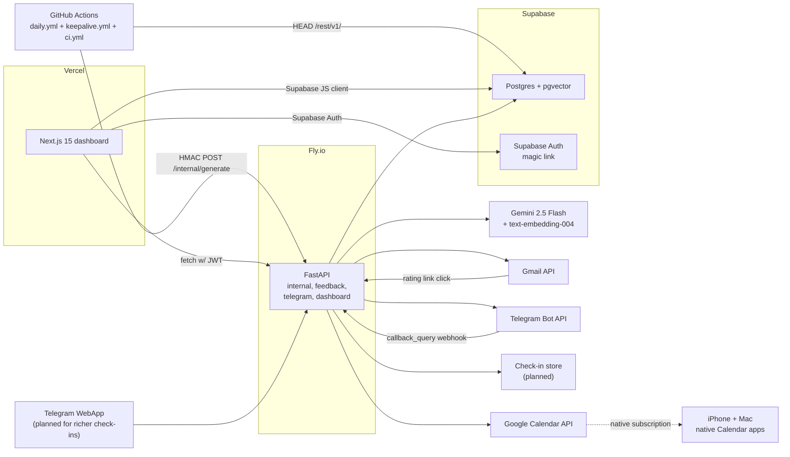

# Implementation Plan — Zen Daily Wisdom Service

> **Purpose of this document.** Single source of truth for the project. If we ever get lost, this is what we come back to. It is a *living document* — update it as decisions are made, not after. Every ADR (Architecture Decision Record) lives in section 20.

**Owner:** Rishabh
**Last updated:** 2026-04-26
**Status:** Phase A — in active implementation (core MVP live, personalization expansion in progress)
**Repo root:** `/Users/rishabh/Documents/Documents/motivational-project`

---

## Table of contents

1. [Scope and goals](#1-scope-and-goals)
2. [Personal configuration (template)](#2-personal-configuration-template)
3. [High-level architecture](#3-high-level-architecture)
4. [Tech stack (locked versions)](#4-tech-stack-locked-versions)
5. [Repo layout](#5-repo-layout)
6. [Data model (Supabase schema)](#6-data-model-supabase-schema)
7. [Service contracts (API endpoints)](#7-service-contracts-api-endpoints)
8. [Dashboard pages (Next.js)](#8-dashboard-pages-nextjs)
9. [Corpus plan (sources, licenses, URLs)](#9-corpus-plan-sources-licenses-urls)
10. [Prompt design](#10-prompt-design)
11. [Bandit design](#11-bandit-design)
12. [Evaluation methodology](#12-evaluation-methodology)
13. [Secrets and environment inventory](#13-secrets-and-environment-inventory)
14. [Deployment runbook](#14-deployment-runbook)
15. [Cost ledger and free-tier discipline](#15-cost-ledger-and-free-tier-discipline)
16. [Failure modes and mitigations](#16-failure-modes-and-mitigations)
17. [Testing strategy](#17-testing-strategy)
18. [Build order (weekend-by-weekend checklist)](#18-build-order-weekend-by-weekend-checklist)
19. [Observability](#19-observability)
20. [Decision log (ADRs)](#20-decision-log-adrs)
21. [Open questions and parking lot](#21-open-questions-and-parking-lot)
22. [Glossary](#22-glossary)

---

## 1. Scope and goals

### What we are building
A personal service that delivers one short, personalized reflection per day to Rishabh's Gmail and Telegram, grounded in public-domain wisdom texts (Indian, Chinese, Japanese, Stoic, Sufi, nature writing, fables, cosmic-wonder writing). Delivery is styled in a calm, zen visual language. A web dashboard tracks mood, rating history, and bandit-based tone personalization.

### Explicit goals (Phase A)
1. Zero recurring monthly cost.
2. One user — Rishabh, authenticated via Supabase Auth magic link, locked via RLS.
3. First real daily email delivered by end of Weekend 2 of the build.
4. All corpus content is public-domain English or free PD English translations.
5. LLM output must cite a specific retrieved passage verbatim (faithfulness guardrail).
6. Doubles as a portfolio / interview artifact demonstrating RAG, evaluation, bandit personalization, full-stack delivery, and ops discipline.

### Non-goals (out of scope)
- Multi-user / auth for anyone other than Rishabh.
- Mobile app (deferred; backend is Phase-B-ready but no mobile work now).
- Marketing / launch / App Store / monetization.
- WhatsApp delivery (rejected; Telegram chosen).
- iCloud CalDAV (rejected; Google Calendar subscribed from native Apple Calendar apps).
- Fine-tuning any local model.
- Replacing Gemini with self-hosted LLMs.

### Success criteria
- **Operational:** Daily email has landed in the inbox on-time (± 30 min) for 30 consecutive days, no manual intervention, $0 spent.
- **Quality:** Mean rating over last 30 days ≥ 3.5/5, with ≥ 70 % of ratings coming from passages in gold tier.
- **Evaluation:** `EVALUATION.md` documents RAG recall@5 ≥ 0.80 on a 50-query hand-labeled set, faithfulness ≥ 0.95 (quoted text present in retrieved chunks).
- **Personal:** Rishabh uses the service for 6 consecutive weeks and can honestly answer "yes, this changed my state" before any Phase B work begins.

---

## 2. Personal configuration (template)

This is the data the generator loads at run-time to personalize tone. Lives in `config/personal.yaml` (gitignored if it contains anything too private; use `config/personal.example.yaml` for the version-controlled template).

```yaml
profile:
  name: Rishabh
  age: 22
  pronouns: he/him
  context: final-year B.Tech student, CS/IT major, Economics minor, Indian
  aspirations:
    - data scientist
    - AI engineer
    - ML researcher
  stress_themes:
    - uncertainty about career
    - pressure of final-year placements
    - future anxiety
    - comparison to peers
  values:
    - presence over anxiety
    - rootedness in tradition
    - craft and patience
    - honesty without flattery

delivery:
  timezone: Asia/Kolkata
  daily_time: "07:00"
  channels: ["email", "telegram"]
  email_address: <redacted, stored in Fly secret>
  telegram_chat_id: <redacted, stored in Fly secret>
  calendar_id: primary           # or a dedicated "Daily Theme" calendar ID

voice:
  never_use:
    - "journey"
    - "embrace"
    - "remember that"
    - "you've got this"
    - "believe"
    - "manifest"
    - "unleash"
    - "warrior"
    - "level up"
    - "crush it"
    - "grind"
    - "hustle"
    - "vibes"
  preferred_length_words: [70, 130]
  allow_direct_second_person: true   # OK to say "you"; set false for more literary register

bandit:
  exploration_rate: 0.15              # epsilon for occasional exploration outside Thompson
  prior_alpha: 1.0
  prior_beta: 1.0

corpus:
  include_silver_tier: true
  silver_sampling_probability: 0.20   # 20 % of messages may draw from silver
```

---

## 3. High-level architecture



### Data flow, daily at 01:30 UTC / 07:00 IST

1. GitHub Actions `daily.yml` fires.
2. Workflow computes an HMAC over `{"date": "YYYY-MM-DD"}` using `INTERNAL_HMAC_SECRET` and POSTs to `https://<fly-app>.fly.dev/internal/generate` with header `X-Internal-Signature`.
3. FastAPI verifies HMAC, checks idempotency (one generation per date), loads user context from Supabase.
4. Style engine selects a daily style (`A/B/C/D`) and retrieval preferences (e.g., Nature/Seasons requires `nature/change/presence` tags).
5. Retrieval service ranks passages with pgvector + style-aware boosts (tag score + seasonal lexical score when applicable).
6. Generator calls Gemini 2.5 Flash with system prompt + style instruction + retrieved context.
7. Validation gate enforces anti-cliche/anti-meta-reference/opening rules and retries once on quality failure.
8. Jinja2 renders `email_zen.html.j2`; Gmail client sends. Telegram client sends inline-keyboard message. Google Calendar client writes all-day event and email includes an add-to-calendar button.
9. Row inserted into `sent_history` with full retrieval trace.
10. Response returned to cron with `{"status": "ok", "sent_id": "..."}`.

### Feedback flow

- **Email:** each rating button is a signed link `GET /feedback?sent_id=...&rating=4&channel=email&sig=...`. FastAPI verifies, inserts into `feedback`, redirects to `/feedback/thanks?sent_id=...` on the Next.js app.
- **Telegram:** inline keyboard sends `callback_query` to `/telegram/webhook`. FastAPI verifies the Telegram secret, inserts feedback, answers the callback.
- **Dashboard:** on feedback insert, a Postgres trigger updates `bandit_state` via a SQL function that computes new `(alpha, beta)` for the arm associated with `sent_history.arm_key`.

### EMA check-in flow (approved design, next implementation block)

1. System sends short check-in prompts 2-3 times/day (email + Telegram/WebApp) with 1-5 scale answers.
2. Responses are stored in a dedicated check-in table with timestamp, window (morning/midday/evening), and optional note.
3. Context aggregator computes daily mood/challenge features.
4. Retrieval and generation consume this context so daily messages are truly personalized.
5. Safety constraints: low-friction questions, burden monitoring, no clinical diagnosis claims.

---

## 4. Tech stack (locked versions)

| Layer | Choice | Version | Rationale |
|---|---|---|---|
| Frontend framework | Next.js | 15.x (App Router) | Vercel first-class, React Server Components, free tier |
| Frontend language | TypeScript | 5.x | Type safety in dashboard |
| CSS | Tailwind CSS | 4.x | Fast iteration, matches shadcn/ui |
| UI primitives | shadcn/ui | latest | Copy-in components, no runtime lib |
| Charting | Recharts | 2.x | React-native, small bundle |
| Backend framework | FastAPI | 0.115+ | Async, Python, clean OpenAPI |
| Backend language | Python | 3.12 | Latest stable, MPS works on M4 |
| Package manager (Python) | uv | latest | 10–100× faster than pip/poetry |
| Package manager (JS) | pnpm | 9.x | Workspaces, disk-efficient |
| Validation | Pydantic | 2.x | FastAPI native, type-safe settings |
| DB client | supabase-py | 2.x | Official, async support |
| Template engine | Jinja2 | 3.x | Email HTML rendering |
| LLM | Gemini 2.5 Flash | current | Free tier 1,500 RPD, 1M context |
| Embeddings | Gemini text-embedding-004 | current | Same provider, free, 768-dim |
| Vector store | pgvector (in Supabase Postgres) | 0.7+ | No separate service |
| LLM SDK | google-genai | 0.8+ | Official Python SDK for Gemini |
| Database | Supabase Postgres | 16.x | Managed, pgvector, Auth, RLS |
| Auth | Supabase Auth | current | Magic link, free |
| Email | Gmail API | v1 | Free, no per-msg cost |
| Gmail SDK | google-api-python-client | 2.x | Official |
| Messaging | Telegram Bot API | HTTPS | Free, unlimited |
| Telegram SDK | python-telegram-bot | 21.x | Most maintained |
| Calendar | Google Calendar API | v3 | Free |
| Scheduling | GitHub Actions cron | n/a | Free on private repo up to 2,000 min/mo |
| Frontend host | Vercel | Hobby | Free, no sleep |
| Backend host | Fly.io | shared-cpu-1x 256MB | Free tier (3 such VMs) |
| Testing (Python) | pytest + pytest-asyncio | latest | Standard |
| Testing (JS) | Vitest | 2.x | Fast, Vite-native |
| Linter (Python) | ruff | latest | Fast, all-in-one |
| Formatter (JS) | Prettier + ESLint | latest | Standard |
| Type checker (Python) | mypy (strict) | latest | Gate CI |

### Explicit non-choices and rationale
- **LangChain / LlamaIndex:** rejected. Retrieval is ~50 lines against pgvector; a framework adds dependency surface with no value.
- **Chroma / Qdrant / Pinecone / Weaviate:** rejected. pgvector handles 10K × 768-dim trivially.
- **Celery / Redis queue:** rejected. The entire workload is one scheduled job per day.
- **Docker Compose for local dev:** rejected. Supabase local is optional; for Phase A connect directly to the hosted free-tier Supabase project with a separate `dev` schema.
- **sentence-transformers local embeddings:** rejected for runtime, acceptable as fallback at ingestion. Reason: avoid shipping 86MB model weights to a 256MB Fly VM.

---

## 5. Repo layout

Monorepo using pnpm workspaces at the JS level and uv for Python. The `apps/frontend` and `apps/backend` are independent deployables.

```
motivational-project/
├── IMPLEMENTATION_PLAN.md        # this file
├── README.md                     # short readme pointing at this doc
├── EVALUATION.md                 # RAG eval + bandit convergence (resume artifact)
├── pnpm-workspace.yaml
├── package.json                  # root, dev tooling only
├── .gitignore
├── .env.example                  # committed template
├── .github/workflows/
│   ├── daily.yml                 # 30 1 * * *
│   ├── keepalive.yml             # 0 8 */3 * *
│   ├── weekly-digest.yml         # 30 1 * * 0
│   └── ci.yml                    # pytest + mypy + vitest + eslint on PRs
├── apps/
│   ├── frontend/                 # Next.js 15
│   │   ├── package.json
│   │   ├── tsconfig.json
│   │   ├── next.config.mjs
│   │   ├── tailwind.config.ts
│   │   ├── app/
│   │   │   ├── layout.tsx
│   │   │   ├── page.tsx                # redirects to /dashboard if authed
│   │   │   ├── (auth)/login/page.tsx
│   │   │   ├── dashboard/page.tsx
│   │   │   ├── corpus/page.tsx
│   │   │   ├── prompts/page.tsx
│   │   │   ├── send-now/page.tsx
│   │   │   └── feedback/thanks/page.tsx
│   │   ├── components/
│   │   │   ├── ui/                     # shadcn components
│   │   │   ├── MoodChart.tsx
│   │   │   ├── FeedbackTable.tsx
│   │   │   ├── BanditPosteriors.tsx
│   │   │   └── CorpusBrowser.tsx
│   │   └── lib/
│   │       ├── supabase.ts             # client creation
│   │       ├── api.ts                  # typed FastAPI client
│   │       └── auth.ts                 # allowlist check
│   └── backend/                        # FastAPI
│       ├── pyproject.toml              # uv-managed
│       ├── uv.lock
│       ├── Dockerfile                  # python:3.12-slim-bookworm multi-stage
│       ├── fly.toml
│       ├── .dockerignore
│       ├── src/zen_backend/
│       │   ├── __init__.py
│       │   ├── main.py                 # FastAPI app factory
│       │   ├── config.py               # pydantic-settings
│       │   ├── logging_setup.py
│       │   ├── routes/
│       │   │   ├── __init__.py
│       │   │   ├── internal.py         # /internal/generate, /internal/weekly, /internal/dry_run
│       │   │   ├── feedback.py         # /feedback (HMAC-signed link)
│       │   │   ├── telegram.py         # /telegram/webhook
│       │   │   ├── dashboard.py        # /dashboard/* (JWT)
│       │   │   └── health.py           # /health
│       │   ├── services/
│       │   │   ├── generator.py
│       │   │   ├── retrieval.py
│       │   │   ├── bandit.py
│       │   │   ├── gemini_client.py
│       │   │   ├── gmail_client.py
│       │   │   ├── telegram_client.py
│       │   │   └── calendar_client.py
│       │   ├── prompts/
│       │   │   ├── system.md
│       │   │   └── reflection.md
│       │   ├── db/
│       │   │   ├── client.py
│       │   │   ├── models.py           # pydantic schemas
│       │   │   └── queries.py          # typed wrappers over supabase-py
│       │   ├── templates/
│       │   │   ├── email_zen.html.j2
│       │   │   └── email_zen.css
│       │   └── security/
│       │       ├── hmac_sig.py
│       │       └── jwt_verify.py
│       └── tests/
│           ├── conftest.py
│           ├── test_retrieval.py
│           ├── test_bandit.py
│           ├── test_prompts_golden.py
│           ├── test_faithfulness.py
│           ├── test_hmac.py
│           └── test_e2e_mock.py
├── packages/
│   └── corpus/                         # runs locally on M4
│       ├── pyproject.toml
│       ├── README.md
│       ├── sources/                    # raw .txt per work (gitignored if large; use LFS if needed)
│       ├── build_index.py              # CLI: chunk, embed, upsert to Supabase
│       ├── datasets/
│       │   ├── huggingface_import.py   # Abirate/english_quotes
│       │   └── mappers.py              # normalize to common Passage dataclass
│       ├── chunkers/
│       │   ├── verse.py                # Gita, Tao, Analects, Dhammapada
│       │   ├── letter.py               # Seneca
│       │   ├── essay.py                # Thoreau, Emerson, Muir
│       │   ├── haiku.py                # Basho, Issa
│       │   └── fable.py                # Aesop, Panchatantra, Jataka
│       └── notebooks/
│           ├── rag_eval.ipynb
│           ├── bandit_convergence.ipynb
│           └── corpus_stats.ipynb
├── infra/
│   └── supabase/
│       ├── migrations/
│       │   ├── 001_init.sql
│       │   ├── 002_rls_policies.sql
│       │   ├── 003_bandit_trigger.sql
│       │   └── 004_indexes.sql
│       └── seed/
│           └── themes.sql              # enumerate canonical theme_tags
├── config/
│   ├── personal.example.yaml
│   └── personal.yaml                   # gitignored
├── scripts/
│   ├── oauth_setup_gmail.py            # one-time
│   ├── oauth_setup_calendar.py         # one-time
│   ├── register_telegram_webhook.py
│   └── local_send_now.py               # hits /internal/generate locally
└── docs/
    ├── ARCHITECTURE.md                 # diagrams + deeper explanation
    ├── ONCALL.md                       # what to do when it breaks
    └── PROMPTS.md                      # prompt iteration notes
```

---

## 6. Data model (Supabase schema)

Full SQL kept in `infra/supabase/migrations/`. Reproduced here for discoverability.

```sql
-- 001_init.sql
create extension if not exists vector;
create extension if not exists pgcrypto;

create table passages (
  id uuid primary key default gen_random_uuid(),
  tradition text not null,
  source text not null,
  citation text not null,
  text text not null,
  theme_tags text[] not null default '{}',
  tone text check (tone in ('gentle','firm','austere','warm','cosmic','playful')),
  length_bucket text check (length_bucket in ('short','medium','long')),
  source_tier text check (source_tier in ('gold','silver')) not null,
  embedding vector(768),
  created_at timestamptz default now(),
  unique (source, citation, text)
);

create table sent_history (
  id uuid primary key default gen_random_uuid(),
  sent_at timestamptz not null default now(),
  sent_date date not null unique,             -- idempotency: one per calendar date
  passage_ids uuid[] not null,
  arm_key text not null,                      -- 'stoic|firm|short|gold'
  arm_tradition text not null,
  arm_tone text not null,
  arm_length text not null,
  arm_source_tier text not null,
  theme_of_day text,
  llm_output text not null,
  prompt_version_id uuid,
  channels text[] not null,
  retrieval_trace jsonb
);

create table feedback (
  id uuid primary key default gen_random_uuid(),
  sent_id uuid references sent_history(id) on delete cascade,
  channel text check (channel in ('email','telegram','dashboard')),
  rating int check (rating between 1 and 5),
  tone_tag text check (tone_tag in ('too_soft','just_right','too_harsh','irrelevant')),
  note text,
  created_at timestamptz default now()
);

create table mood_log (
  id uuid primary key default gen_random_uuid(),
  logged_at timestamptz default now(),
  score int check (score between 1 and 5) not null,
  note text
);

create table bandit_state (
  arm_key text primary key,
  alpha numeric not null default 1.0,
  beta  numeric not null default 1.0,
  pulls int not null default 0,
  last_updated timestamptz default now()
);

create table prompt_versions (
  id uuid primary key default gen_random_uuid(),
  kind text check (kind in ('system','reflection')) not null,
  version int not null,
  body text not null,
  is_active boolean not null default false,
  created_at timestamptz default now(),
  unique (kind, version)
);

-- 004_indexes.sql
create index passages_embedding_idx on passages using ivfflat (embedding vector_cosine_ops) with (lists = 100);
create index passages_tradition_idx on passages (tradition);
create index passages_tier_idx on passages (source_tier);
create index passages_theme_idx on passages using gin (theme_tags);
create index passages_tone_length_idx on passages (tone, length_bucket);
create index sent_history_date_idx on sent_history (sent_date);
create index feedback_sent_idx on feedback (sent_id);
create index mood_log_logged_idx on mood_log (logged_at desc);
```

### Row-level security (002_rls_policies.sql)
All tables enable RLS. Single-user model: the only authenticated user is Rishabh's Supabase auth UUID (stored as an env var on the Fly backend, read from `auth.uid()` in policies).

```sql
alter table passages enable row level security;
alter table sent_history enable row level security;
alter table feedback enable row level security;
alter table mood_log enable row level security;
alter table bandit_state enable row level security;
alter table prompt_versions enable row level security;

-- Dashboard (client-side Supabase) reads via JWT
create policy "owner can read" on passages for select using (auth.uid() = (select value::uuid from app_config where key = 'owner_uid'));
-- (repeat for each table as appropriate; writes happen via service role from FastAPI only)
```

### Bandit trigger (003_bandit_trigger.sql)
On each `feedback` insert, update the corresponding `bandit_state` row.

```sql
create or replace function update_bandit_on_feedback() returns trigger as $$
declare
  v_arm text;
  v_success boolean;
begin
  select arm_key into v_arm from sent_history where id = new.sent_id;
  v_success := new.rating >= 4;      -- treat 4+ as success
  insert into bandit_state (arm_key, alpha, beta, pulls)
    values (v_arm, 1.0 + (case when v_success then 1 else 0 end),
                   1.0 + (case when v_success then 0 else 1 end), 1)
    on conflict (arm_key) do update set
      alpha = bandit_state.alpha + (case when v_success then 1 else 0 end),
      beta  = bandit_state.beta  + (case when v_success then 0 else 1 end),
      pulls = bandit_state.pulls + 1,
      last_updated = now();
  return new;
end;
$$ language plpgsql;

create trigger on_feedback_update_bandit
  after insert on feedback
  for each row execute function update_bandit_on_feedback();
```

### Canonical enums (keep in sync with code)

- **traditions:** `bhagavad_gita`, `upanishads`, `dhammapada`, `jataka`, `panchatantra`, `tao_te_ching`, `analects`, `zhuangzi`, `hagakure`, `basho`, `issa`, `musashi`, `marcus_aurelius`, `seneca`, `epictetus`, `rumi`, `saadi`, `hafiz`, `thoreau`, `emerson`, `muir`, `burroughs`, `gibran`, `lucretius`, `whitman`, `aesop`, `tagore`, `kabir`
- **theme_tags:** `impermanence`, `work`, `solitude`, `friendship`, `courage`, `patience`, `craft`, `nature`, `animals`, `cosmos`, `wonder`, `death`, `joy`, `sorrow`, `fear`, `doubt`, `presence`, `duty`, `humility`, `freedom`, `discipline`, `love`, `longing`, `silence`, `change`, `comparison`, `ambition`, `rest`
- **tone:** `gentle`, `firm`, `austere`, `warm`, `cosmic`, `playful`
- **length_bucket:** `short` (< 40 words), `medium` (40–120), `long` (> 120)

---

## 7. Service contracts (API endpoints)

All endpoints served by FastAPI at `https://zen-backend.fly.dev` (tentative). Internal endpoints require HMAC; dashboard endpoints require Supabase JWT.

### Public (HMAC-protected)
- `POST /internal/generate` — triggers daily generation. Body: `{"date": "YYYY-MM-DD", "force": false}`. Header: `X-Internal-Signature: hex(hmac_sha256(secret, body))`. Returns `{"sent_id": "...", "status": "ok"}` or `{"status": "already_sent"}`.
- `POST /internal/weekly` — Sunday digest. Body: `{"week_of": "YYYY-MM-DD"}`. Same HMAC scheme.
- `POST /internal/dry_run` — generate without sending. Used by prompt tuning UI.

### Public (link-signed)
- `GET /feedback?sent_id=&rating=&channel=email&sig=` — HMAC of `sent_id|rating|channel`. Inserts feedback, 302 to `/feedback/thanks?sent_id=...` on frontend.

### Public (Telegram-shared-secret)
- `POST /telegram/webhook` — Telegram sends updates; verify `X-Telegram-Bot-Api-Secret-Token` header (we set this when registering). Handles `/start`, `/mood <1-5>`, `/stop` (planned), and inline callback_queries.

### Public (check-in, planned)
- `POST /checkin/submit` — submit check-in answers from email form or Telegram web app.
- `POST /internal/checkin-reminders` — scheduler-triggered endpoint for 2-3 daily reminder windows.

### Dashboard (Supabase JWT required)
- `GET /dashboard/today` — today's `sent_history` row.
- `GET /dashboard/history?limit=30` — paginated sent_history + feedback rollup.
- `GET /dashboard/bandit` — current bandit_state with derived expected values.
- `GET /dashboard/checkins` — recent check-in records + adherence stats (planned).
- `GET /dashboard/corpus?q=&tradition=&theme=` — passage search.
- `POST /dashboard/send-now` — force re-generation (requires `confirm: true`).
- `GET /dashboard/prompts` — list prompt versions.
- `POST /dashboard/prompts` — create a new prompt version (not activated).
- `POST /dashboard/prompts/:id/activate` — set active, deactivate others of same kind.

### Health
- `GET /health` — returns DB ping + Gemini ping status. Used by deployment smoke tests.

### HMAC scheme (reused across internal + feedback)
```
message  = body_bytes_or_query_canonical
digest   = hmac_sha256(INTERNAL_HMAC_SECRET, message)
header   = hex(digest)
```
Timestamp header `X-Internal-Timestamp` required; reject if skew > 5 min to prevent replay.

---

## 8. Dashboard pages (Next.js)

Each page is gated by Supabase Auth; unauthenticated users are redirected to `/login`. On login, middleware checks that the authed email is in the `ALLOWED_EMAILS` env var (just Rishabh's email) — anyone else is 403'd.

### `/login`
- Supabase magic link form. Email input → sends link → landing back at `/dashboard`.

### `/dashboard`
- Top card: today's passage + reflection + theme + style label (`A/B/C/D`). "Open in Gmail" link.
- Mood chart: 30-day line chart. Clicking a point shows that day's message.
- Feedback history: 30-row table (date, tradition, tone, passage excerpt, rating, tone_tag).
- Style history: style label shown per message to correlate with feedback.
- Bandit posteriors: bar chart of expected value per arm, sorted descending.
- "Log mood" quick form (1–5 + optional note).
- "Send now" button (requires typed confirmation).
- Check-in adherence card (planned): completion rate by reminder window.

### `/corpus`
- Search input, filters (tradition multi-select, theme multi-select, tier toggle, tone, length).
- Paginated list of passages. Each row expands to show usage history (how many times sent, avg rating, last sent date).
- Edit buttons (stretch goal): flag passage as "never-send", correct tags.

### `/prompts`
- Two tabs: `system` and `reflection`.
- Latest version on the left, editor on the right.
- "Dry-run against last 5" button calls `/internal/dry_run` and shows rendered outputs side-by-side with current production outputs.
- "Save as new version" → creates row; "Activate" sets it live.

### `/send-now`
- Single-page form: choose tradition override (optional), tone override (optional), "confirm and send" button.
- Useful when debugging.

### `/feedback/thanks`
- Minimal page: "Thanks. One more thing — how do you feel right now?" (1–5 mood buttons + optional note). Posts to `/dashboard/mood` or directly to Supabase.

---

## 9. Corpus plan (sources, licenses, URLs)

### Gold tier (public-domain primary texts)

| Tradition | Work | Translator | Source URL | License |
|---|---|---|---|---|
| Indian | Bhagavad Gita | Edwin Arnold (*The Song Celestial*) / Sivananda | https://www.gutenberg.org/ebooks/2388 | PD (US) |
| Indian | Upanishads | Max Müller (*Sacred Books of the East*) | https://www.sacred-texts.com/hin/sbe01/ | PD |
| Indian | Dhammapada | Max Müller / F. Max Müller | https://www.gutenberg.org/ebooks/2017 | PD |
| Indian | Jataka Tales | H. T. Francis | https://www.sacred-texts.com/bud/j1/ | PD |
| Indian | Panchatantra | Arthur W. Ryder | https://archive.org/details/panchatantra00ryde | PD (US, 1925) |
| Indian | Gitanjali | Rabindranath Tagore (self-translated) | https://www.gutenberg.org/ebooks/7164 | PD |
| Indian | Kabir's Songs | Tagore + Underhill | https://www.gutenberg.org/ebooks/6519 | PD |
| Chinese | Tao Te Ching | James Legge | https://www.gutenberg.org/ebooks/216 | PD |
| Chinese | Analects | James Legge | https://www.gutenberg.org/ebooks/3330 | PD |
| Chinese | Zhuangzi (inner chapters) | James Legge | https://www.sacred-texts.com/tao/sbe39/ | PD |
| Japanese | Hagakure | Takao Mukoh (old translation) — or curate short passages | https://archive.org/ | check per edition |
| Japanese | Basho haiku | various PD compilations | https://www.gutenberg.org/ebooks/36339 | PD |
| Japanese | Issa haiku | R. H. Blyth — NOT PD, use PD alternates | avoid; use Basho + PD haiku anthologies | |
| Japanese | Book of Five Rings | Victor Harris — NOT PD; use Thomas Cleary 1993 — NOT PD; use older PD summary only | treat cautiously | |
| Stoic | Meditations of Marcus Aurelius | George Long | https://www.gutenberg.org/ebooks/2680 | PD |
| Stoic | Seneca, Letters from a Stoic | Richard Mott Gummere | https://www.gutenberg.org/ebooks/56075 | PD |
| Stoic | Epictetus, Enchiridion | Elizabeth Carter | https://www.gutenberg.org/ebooks/45109 | PD |
| Stoic | Epictetus, Discourses | George Long | https://www.gutenberg.org/ebooks/10661 | PD |
| Sufi | Rumi, Masnavi | E. H. Whinfield | https://www.sacred-texts.com/isl/masnavi/ | PD |
| Sufi | Rumi, selected poems | R. A. Nicholson | https://archive.org/ | PD where pre-1929 |
| Sufi | Saadi, Gulistan | Edward Rehatsek | https://www.gutenberg.org/ebooks/35997 | PD |
| Sufi | Hafiz | Gertrude Bell (*Poems from the Divan*) | https://www.gutenberg.org/ebooks/40184 | PD |
| Nature | Walden | Henry David Thoreau | https://www.gutenberg.org/ebooks/205 | PD |
| Nature | Essays, Nature, Self-Reliance | Ralph Waldo Emerson | https://www.gutenberg.org/ebooks/16643 | PD |
| Nature | My First Summer in the Sierra | John Muir | https://www.gutenberg.org/ebooks/32540 | PD |
| Nature | Wake-Robin, Signs and Seasons | John Burroughs | https://www.gutenberg.org/ebooks/6982 | PD |
| Life | The Prophet | Kahlil Gibran | https://www.gutenberg.org/ebooks/58585 | PD (1923) |
| Cosmos | De Rerum Natura | Lucretius (W. E. Leonard trans.) | https://www.gutenberg.org/ebooks/785 | PD |
| Cosmos | Leaves of Grass | Walt Whitman | https://www.gutenberg.org/ebooks/1322 | PD |
| Animals | Aesop's Fables | George Fyler Townsend | https://www.gutenberg.org/ebooks/21 | PD |

### Silver tier
- [Abirate/english_quotes](https://huggingface.co/datasets/Abirate/english_quotes) — CC BY 4.0. Import with attribution. Tag all rows `source_tier='silver'` and `theme_tags` derived from the dataset's `tags` field after a normalization mapping.

### Explicitly rejected
- `jstet/quotes-500k` — license ambiguity, Goodreads misattribution noise.
- Modern copyrighted translations (Mitchell Tao, Easwaran Gita, Barks Rumi, Wilson Hagakure, Cleary Musashi). Stay on PD translations only.

### Chunking strategy per type
| Source type | Chunker | Unit |
|---|---|---|
| Verse texts (Gita, Tao, Dhammapada, Analects) | `verse.py` | 1 verse |
| Letters (Seneca) | `letter.py` | 1 paragraph, max 150 words |
| Essays (Thoreau, Emerson, Muir, Burroughs) | `essay.py` | paragraph, split at >150 words on sentence boundaries |
| Haiku | `haiku.py` | 1 poem |
| Fables (Aesop, Panchatantra, Jataka) | `fable.py` | whole fable (title + body + moral) |
| Prophet (Gibran) | `essay.py` with section detection | 1 chapter = 1 passage or split at >200 words |

### Theme-tagging strategy
- Manual canonical list from personal.yaml themes + a curated extension (see enum in section 6).
- Initial tagging pass: rules-based keyword scan (e.g., "forest" + "silence" → `nature`+`solitude`).
- Second pass: Gemini batch-tag on first ingestion run. Prompt: "Given this passage, pick up to 3 tags from this list. No commentary." Run once, persist, edit manually where wrong via the `/corpus` dashboard page (stretch).

---

## 10. Prompt design

### System prompt (`apps/backend/src/zen_backend/prompts/system.md`)

Skeleton, to be refined through prompt_versions iteration:

```
You are a voice for Rishabh, 22, Indian B.Tech final-year student aspiring to work in ML / AI. You write one short English reflection per day grounded in a passage he will be shown.

Requirements:
1. You MUST quote one passage from the PROVIDED PASSAGES verbatim, inside a single-line quote block, followed by its citation.
2. You MUST NOT invent or paraphrase quotations.
3. Your reflection is 70–130 English words, in a calm, direct register.
4. You MUST NOT use these phrases: {{forbidden_phrases}}.
5. You MUST NOT flatter the reader or use self-help clichés.
6. Do not tell him what to feel. Point him to what is already there.
7. Output strict JSON with keys: passage_id, reflection, theme_of_day (max 4 words).
8. theme_of_day is a phrase that could appear on a calendar ("patience with work", "the long view", "one honest hour").

You are writing in English regardless of the source language of the passage.
```

### Reflection / user prompt (`reflection.md`)

```
## Today's context
Date: {{date}} ({{weekday}})
Season: {{season}} in {{location}}
Recent mood (last 7 days): {{mood_summary}}
Stress themes worth holding: {{stress_themes}}

## Arm sampled
Tradition: {{tradition}}
Tone: {{tone}}
Length: {{length_bucket}}

## Provided passages (choose exactly one to quote)
{{#each passages}}
- id: {{id}}
  tradition: {{tradition}}
  source: {{source}}, {{citation}}
  text: "{{text}}"
{{/each}}

Return JSON only.
```

### Post-generation checks
1. **JSON parse** — fail and retry once on malformed JSON.
2. **Forbidden-phrase check** — case-insensitive regex for each banned phrase; fail closed if any hit, retry once with a reinforcement note.
3. **Faithfulness check** — normalize whitespace, extract quoted block from reflection, assert substring match against one of `passages[*].text`. Fail closed if no match; retry once.
4. **Length check** — 50–180 words (slack on the 70–130 target). Outside range → retry once.
5. After 2 retries → alert via Telegram "generation failed, fell back to cached", serve the most-recent 5-star passage with a fixed opening sentence.

---

## 11. Bandit design

### Arm space
Cartesian product of `tradition × tone × length_bucket × source_tier` filtered to only combinations that have ≥ 3 passages in the corpus. Expected cardinality: ~200–400 arms.

To avoid cold-start starvation, group arms into **super-arms** at the `tradition × tone` level (~45 arms) for the first 100 days. Drill down to full arms once we have ≥ 300 total feedback rows.

### Sampling
- For each pull, draw one sample from `Beta(alpha, beta)` per super-arm; pick argmax.
- With probability `exploration_rate` (0.15 from `personal.yaml`), ignore the bandit and pick uniformly from under-pulled arms (< `mean_pulls / 2`).

### Reward
- Feedback rating 4–5 → success (`alpha += 1`).
- Rating 1–3 → failure (`beta += 1`).
- `tone_tag` = `irrelevant` → failure regardless of rating.
- Missing feedback for 72 h → treat as neutral (no update). Do not penalize silence — might just mean Rishabh was busy.

### Warm start
Seed `bandit_state` with `Beta(1, 1)` priors for all valid super-arms at ingestion completion.

### Evaluation
Simulate with synthetic feedback generator in `notebooks/bandit_convergence.ipynb` to confirm convergence to the top arm within ~200 pulls under realistic noise. Include plot in `EVALUATION.md`.

---

## 12. Evaluation methodology

### RAG recall@5
1. Hand-label 50 queries of the form `(stress_theme, preferred_tone) → [expected_tradition_1, expected_tradition_2]`.
2. For each query, run the retrieval service, take top 5 passages, check if any is from an expected tradition.
3. Report macro recall@5. Target ≥ 0.80.
4. Plot recall vs `k` (1, 3, 5, 10).

### Faithfulness
1. For 100 recent `sent_history` entries, extract the quoted span from `llm_output`.
2. For each, check substring match against `passages[*].text` where `passages.id IN sent_history.passage_ids`.
3. Report percentage. Target ≥ 0.95.

### Personalization lift (after 4 weeks of real feedback)
1. Compute mean rating per super-arm.
2. Compute lift of bandit-selected arms vs uniform-random baseline (replay evaluation using `retrieval_trace` on past data).
3. Report as a table in `EVALUATION.md`.

### Prompt ablation
1. Define 3 prompt variants: `v1_base`, `v2_shorter`, `v3_more_grounded`.
2. For each, generate 10 outputs on fixed passage sets.
3. Score manually (blind) on a 1–5 rubric for: tone match, faithfulness, literary quality, non-cliché.
4. Include the anonymized score table.

---

## 13. Secrets and environment inventory

All secrets stored as Fly.io secrets on backend, Vercel env vars on frontend, and GitHub Actions encrypted secrets for cron jobs. `.env.example` in repo documents names, never values.

| Name | Where used | How obtained |
|---|---|---|
| `SUPABASE_URL` | backend, frontend, GH Actions | Supabase project settings |
| `SUPABASE_ANON_KEY` | frontend | Supabase project settings |
| `SUPABASE_SERVICE_ROLE_KEY` | backend only | Supabase project settings (**never** to frontend) |
| `OWNER_UID` | backend, RLS policies | Supabase Auth user UUID (Rishabh) |
| `ALLOWED_EMAILS` | frontend middleware | static: Rishabh's Gmail |
| `GEMINI_API_KEY` | backend | AI Studio, in billing-**disabled** GCP project |
| `GEMINI_DAILY_CALL_CAP` | backend | static: 20 |
| `GMAIL_CLIENT_ID`, `GMAIL_CLIENT_SECRET` | backend | Google Cloud OAuth client |
| `GMAIL_REFRESH_TOKEN` | backend | one-time OAuth flow (`scripts/oauth_setup_gmail.py`) |
| `GMAIL_FROM_ADDRESS` | backend | Rishabh's Gmail |
| `GCAL_CLIENT_ID`, `GCAL_CLIENT_SECRET`, `GCAL_REFRESH_TOKEN` | backend | same flow |
| `GCAL_CALENDAR_ID` | backend | created via script on first run |
| `TELEGRAM_BOT_TOKEN` | backend | BotFather |
| `TELEGRAM_WEBHOOK_SECRET` | backend | generated, set when registering webhook |
| `TELEGRAM_CHAT_ID` | backend | from first `/start` message |
| `INTERNAL_HMAC_SECRET` | backend, GH Actions | 32-byte random hex |
| `FEEDBACK_LINK_SECRET` | backend | 32-byte random hex, separate from internal |
| `BACKEND_URL` | frontend, GH Actions | Fly app URL |
| `SENTRY_DSN` *(optional)* | backend, frontend | free tier |
| DNS `SPF` record | sender domain DNS | domain registrar / DNS host |
| DNS `DKIM` record(s) | sender domain DNS | ESP/Gmail/domain provider |
| DNS `DMARC` record | sender domain DNS | domain registrar / DNS host |

### Secret generation
```bash
python -c "import secrets; print(secrets.token_hex(32))"
```

---

## 14. Deployment runbook

### One-time setup (in this order)

1. **GitHub repo** — create private repo `motivational-project`, push scaffold, protect `main`.
2. **Supabase** — create project in nearest region (Mumbai if available), copy `URL`, `ANON_KEY`, `SERVICE_ROLE_KEY`. Run migrations via Supabase CLI.
3. **GCP** — create new project, **disable billing** explicitly, enable Gemini API, create API key. Separately enable Gmail API + Calendar API in a **different** GCP project (billing also disabled). Create OAuth 2.0 Desktop client. Run `scripts/oauth_setup_gmail.py` locally to obtain refresh token. Same for calendar.
4. **Telegram** — `/newbot` with BotFather. Note token. Start a chat with the bot, get chat_id. Run `scripts/register_telegram_webhook.py` once webhook URL exists.
5. **Fly.io** — install `flyctl`, `fly launch` from `apps/backend/`, set org, region (bom for Mumbai), use shared-cpu-1x 256MB. Set secrets via `fly secrets set`. Set hard spend limit $0 in dashboard.
6. **Vercel** — import repo, set root to `apps/frontend`, configure env vars. Deploy.
7. **GitHub Actions** — add repo secrets (`INTERNAL_HMAC_SECRET`, `BACKEND_URL`, `SUPABASE_URL`, Supabase ping key). Enable Actions.
8. **Register Telegram webhook** — run `scripts/register_telegram_webhook.py` pointing at Fly URL.
9. **Seed corpus** — run `packages/corpus/build_index.py` locally from M4 Pro against the Supabase project.
10. **Smoke test** — run `scripts/local_send_now.py` to trigger `/internal/generate` manually. Verify email + Telegram + Calendar land.

### Ongoing deploys
- Backend: `fly deploy` from `apps/backend/` or via GitHub Actions on merge to `main`.
- Frontend: auto-deploys from Vercel on push to `main`.
- Corpus updates: re-run `build_index.py` locally; it upserts by `(source, citation, text)` uniqueness.

### Rollback
- Backend: `fly releases list`, `fly releases rollback <version>`.
- Frontend: Vercel dashboard → promote previous deployment.
- DB schema: migrations are forward-only; write explicit down migrations only if truly needed.

---

## 15. Cost ledger and free-tier discipline

| Service | Tier | Limit | Expected usage | Monthly cost |
|---|---|---|---|---|
| Vercel | Hobby | 100 GB bandwidth, no sleep | <100 MB | $0 |
| Fly.io | Free | 3 × shared-cpu-1x 256MB, 3 GB volume | 1 VM, mostly idle | $0 |
| Supabase | Free | 500 MB DB, 1 GB storage, 50K MAUs, pauses after 7-day idle | <10 MB data | $0 |
| Gemini 2.5 Flash | Free | 1,500 RPD, 250K TPM | ~5 gen calls/day | $0 |
| Gemini text-embedding-004 | Free | Generous | ~10K at ingestion, then 1/day | $0 |
| Gmail API | Free | 1B quota units/day | 100 units/email × 1/day | $0 |
| Telegram Bot API | Free | n/a | ~1 msg/day | $0 |
| Google Calendar API | Free | Generous | 1 event/day | $0 |
| GitHub Actions | Free (private) | 2,000 min/month | ~150 min/month | $0 |
| **Total** | | | | **$0/month** |

### Hard guards
- **Gemini:** API key in billing-**disabled** GCP project. Client-side `GEMINI_DAILY_CALL_CAP=20` enforced. Alert via Telegram if approached.
- **Fly:** spend cap $0 in dashboard. `fly scale count 1` only.
- **Supabase:** 3-day keep-alive cron. Monitor DB size monthly.
- **Vercel:** no functions in the frontend that call paid services.

---

## 16. Failure modes and mitigations

| Failure | Probability | Impact | Mitigation |
|---|---|---|---|
| Gemini billing trap | Medium | $$$ surprise | Billing-disabled GCP project; hard-cap env var |
| Supabase 7-day pause | High | Service dies | `keepalive.yml` every 3 days |
| Gmail OAuth refresh token revoked | Low | No emails | Re-run `oauth_setup_gmail.py`; Telegram alert on send failure |
| Fly.io machine OOM (256MB tight) | Medium | Daily job fails | Monitor memory; fallback to async streaming; upgrade to 512MB ($1.94/mo) only if needed |
| LLM hallucinated quote | Medium | Bad UX | Faithfulness substring check + retry; fallback to cached |
| LLM cliché output | Medium | Bad UX | Forbidden-phrase regex + retry |
| Corpus misattribution (silver) | Medium | Bad provenance | Gold-tier bias 80 %; flag tier in email footer |
| Telegram webhook de-registered | Low | No TG delivery | Monthly health check that pings `getWebhookInfo` |
| GitHub Actions cron skipped | Low | Missed day | Exit code logged; re-trigger from dashboard "Send Now" |
| HMAC secret leaked | Very low | Abuse of `/internal` | Rotate secret, redeploy both backend and GH Actions |
| Rishabh's Gmail compromised | Very low | Everything breaks | 2FA on everything, App Passwords, audit secrets quarterly |
| **Rishabh stops using it after 2 weeks** | **High** | **Project dead** | Keep daily email short (< 20s to engage); expose metrics (days_used, streak) on dashboard; be honest with yourself and shut it down if unused |

---

## 17. Testing strategy

### Unit (pytest)
- `test_retrieval.py` — 30 golden queries → expected tradition in top-5. Uses a pinned mini-corpus of ~200 passages in a test Supabase schema or SQLite + in-memory vector search.
- `test_bandit.py` — Thompson sampling convergence on synthetic reward distribution; edge cases (0 pulls, all-failure arm).
- `test_prompts_golden.py` — fixed input + fixed passage set → snapshot output; Gemini mocked with deterministic fixture; assert JSON schema, presence of required keys.
- `test_faithfulness.py` — given fake LLM outputs with and without valid quotes, assert checker behaviour.
- `test_hmac.py` — valid / invalid / expired / tampered body.
- `test_e2e_mock.py` — full pipeline with Gemini mocked; assert DB rows written, email fixture rendered, Telegram call stubbed.

### Frontend (Vitest)
- Smoke tests for login gate, dashboard data fetching hooks, chart rendering.

### CI
- GitHub Actions `ci.yml`: on every PR, `uv run ruff check`, `uv run mypy --strict`, `uv run pytest`, `pnpm --filter frontend lint`, `pnpm --filter frontend vitest run`, `pnpm --filter frontend tsc --noEmit`.
- Fail PR if any step fails.

### Manual QA per deploy
- `curl /health` returns ok.
- `scripts/local_send_now.py` sends a test email.
- Dashboard loads, login works, today's message visible.

---

## 18. Build order (weekend-by-weekend checklist)

### Progress snapshot (as of 2026-04-26)
- Core backend/frontend/scaffold, auth gate, feedback links, Telegram callbacks, style-aware generation, and Gmail template redesign are implemented.
- Corpus expanded to 6,687 passages with embeddings backfilled; style D retrieval now prioritizes nature/season context.
- Remaining high-priority work: full bandit service, check-in pipeline, prompt management UI/endpoints, weekly digest, and evaluation artifacts.

### Weekend 1 — plumbing, no content yet
- [ ] Create GitHub repo, scaffold monorepo per section 5.
- [ ] Root `pnpm-workspace.yaml`, `package.json`, `.gitignore`, `.env.example`.
- [ ] `apps/backend`: `pyproject.toml` (uv), FastAPI skeleton with `/health`, Dockerfile, `fly.toml`.
- [ ] `apps/frontend`: Next.js 15 init, Tailwind, shadcn/ui `button card input`.
- [ ] Create Supabase project; run `001_init.sql`, `002_rls_policies.sql`.
- [ ] Create GCP project 1 (Gemini), disable billing, get API key.
- [ ] Create GCP project 2 (Gmail + Calendar), disable billing, OAuth client.
- [ ] `scripts/oauth_setup_gmail.py` → refresh token.
- [ ] `fly launch` and first deploy with just `/health`.
- [ ] Vercel deploy of login page.
- [ ] Set all Fly secrets; set Vercel env vars; set GH Actions secrets.
- [ ] `local_send_now.py` successfully hits `/internal/generate` which returns "not implemented yet" — prove the HMAC path works.
- [ ] **Exit criterion:** `curl /health` from anywhere returns ok; Vercel login page loads; Supabase is reachable from backend.

### Weekend 2 — first real email
- [ ] Corpus ingestion for 3 sources: Bhagavad Gita, Tao Te Ching, Marcus Aurelius Meditations. Manual `theme_tags` on ~10 % to test retrieval; rest rules-based.
- [ ] `services/retrieval.py` with pgvector cosine top-k + filters; 10 hand-written golden tests pass.
- [ ] `services/gemini_client.py` with rate-limit guard.
- [ ] `services/generator.py` end-to-end: retrieve → Gemini → forbidden check → faithfulness check → render → Gmail send.
- [ ] `templates/email_zen.html.j2` — 600px, palette, fonts, 1 passage, 1 reflection, rating buttons.
- [ ] `.github/workflows/daily.yml` with HMAC.
- [ ] `.github/workflows/keepalive.yml`.
- [ ] Manually trigger daily; verify real email arrives.
- [ ] **Exit criterion:** a real personalized email is in Rishabh's inbox, triggered by GH Actions cron.

### Weekend 3 — Telegram + full corpus + bandit
- [ ] Telegram bot registered, `/telegram/webhook` implemented, inline keyboard on messages.
- [ ] Mirror email content to Telegram (Markdown V2).
- [ ] Corpus ingestion: remaining gold-tier sources (section 9 table). Aim for 6–10K passages total.
- [ ] HuggingFace silver-tier import.
- [ ] `services/bandit.py` with Thompson sampling; `003_bandit_trigger.sql` updates state on feedback.
- [ ] `routes/feedback.py` with HMAC-signed links; rating buttons in email now functional.
- [ ] Weekly digest workflow `.github/workflows/weekly-digest.yml`.
- [ ] **Exit criterion:** feedback closed-loop; clicking a rating in email updates bandit state; Telegram buttons do the same.

### Weekend 4 — dashboard + calendar
- [ ] Next.js dashboard page with today's message, mood chart (Recharts), feedback table.
- [ ] `/corpus` page with search + filters.
- [ ] `/send-now` page with confirmation.
- [ ] `/feedback/thanks` page with mood note form.
- [ ] `services/calendar_client.py` — create "Daily Theme" Google Calendar, write all-day event.
- [ ] Subscribe to that calendar from iPhone + Mac Calendar apps; confirm `theme_of_day` appears.
- [ ] **Exit criterion:** dashboard usable on phone; mood chart shows at least a week of data; theme-of-day appears on both Apple devices.

### Weekend 5 — evaluation + polish
- [ ] `notebooks/rag_eval.ipynb` with 50 hand-labeled queries; compute recall@5; plot.
- [ ] `notebooks/bandit_convergence.ipynb` with simulated reward convergence.
- [ ] `notebooks/corpus_stats.ipynb` — tradition/theme coverage.
- [ ] `EVALUATION.md` writing up methodology + results.
- [ ] `/prompts` dashboard page with dry-run.
- [ ] Prompt ablation on 10 outputs; results in EVALUATION.md.
- [ ] README with architecture diagram, runbook, cost ledger, one-paragraph "what this is".
- [ ] `docs/ONCALL.md` with debugging flowchart.
- [ ] Remove TODO markers, close milestones.
- [ ] **Exit criterion:** repo is portfolio-ready; README is the thing a recruiter reads first and it makes sense in 2 minutes.

### Weekend 6 — personalization 2.0 (new)
- [ ] Implement check-in schema + migration(s) and query wrappers.
- [ ] Add check-in reminder scheduler (`/internal/checkin-reminders`) for 2-3 daily windows.
- [ ] Add check-in submission endpoint and email/Telegram collection UX.
- [ ] Aggregate check-in context into retrieval/generation.
- [ ] Add dashboard adherence and challenge trend panels.
- [ ] **Exit criterion:** messages use same-day check-in context and perceived personalization is noticeably higher.

### After Weekend 5 — use it
- Daily discipline: rate the email for 6 weeks. Track whether you actually open and read it. Honest check-in after 6 weeks on whether it changed your state.

---

## 19. Observability

Minimal; this is a single-user project.

- **Structured logs:** Python `logging` with JSON formatter in backend. Fly.io aggregates stdout — inspect via `fly logs`.
- **Daily success signal:** After every successful generation, POST a heartbeat to a free service (e.g., [healthchecks.io](https://healthchecks.io) free tier, 20 checks). Receive email/Telegram if the heartbeat is missed for 25 h.
- **Error notifications:** On any unhandled exception in `/internal/*`, send a Telegram message to Rishabh with short error summary. Do not include secrets or passage text.
- **Dashboard metrics:** `days_used`, `current_streak`, `avg_rating_last_30`, `feedback_rate` visible on dashboard home as a gentle accountability signal.

---

## 20. Decision log (ADRs)

Short architecture decision records. Append-only. Reference by number.

### ADR-001 — Use Next.js + FastAPI + Supabase instead of cron-and-scripts
- **Date:** planning
- **Status:** accepted
- **Context:** For single-user Phase A, a script + cron is sufficient. Full stack adds setup time but doubles as portfolio piece and makes Phase B painless.
- **Decision:** Adopt Next.js + FastAPI + Supabase.
- **Consequences:** +1 weekend of setup; +4 moving parts; +strong resume signal; +dashboard for free. Need keep-alive cron for Supabase.

### ADR-002 — Telegram, not WhatsApp
- **Status:** accepted
- **Context:** WhatsApp Business API requires business verification, separate phone number, template approval. Unofficial libraries risk ban. Telegram is free, unlimited, 5-min setup.
- **Decision:** Telegram only.
- **Consequences:** Delivery UX identical from the user's POV. Zero cost.

### ADR-003 — Google Calendar, not iCloud CalDAV
- **Status:** accepted
- **Context:** iCloud has no REST API. CalDAV is legacy XML-over-HTTP; no OAuth. Google Calendar is clean REST + OAuth and syncs to Apple Calendar apps natively via subscription.
- **Decision:** Write to Google Calendar; subscribe from iPhone + Mac.
- **Consequences:** Setup is 3 clicks on the Apple side; engineering effort 1 service call.

### ADR-004 — pgvector in Supabase, not a separate vector DB
- **Status:** accepted
- **Context:** 8–15K passages × 768-dim is ~45 MB. Chroma/Qdrant/Pinecone add services for zero functional gain at this scale.
- **Decision:** pgvector in Supabase Postgres.
- **Consequences:** One less service; SQL joins across metadata and vectors; use ivfflat index.

### ADR-005 — Gemini embeddings at both ingestion and query time
- **Status:** accepted
- **Context:** Using different models for ingestion vs query breaks cosine similarity math. Shipping sentence-transformers to 256MB Fly VM is tight.
- **Decision:** Gemini `text-embedding-004` everywhere. sentence-transformers as local fallback only.
- **Consequences:** Network call on every retrieval query (~100 ms). Acceptable for daily cron.

### ADR-006 — Two-tier corpus (gold + silver), reject Quotes-500K
- **Status:** accepted
- **Context:** Primary PD texts give grounding; HF scraped datasets give breadth but noise. Quotes-500K has license ambiguity + heavy misattribution.
- **Decision:** Gold from Gutenberg; silver from Abirate/english_quotes only. Reject Quotes-500K.
- **Consequences:** Smaller silver tier; cleaner provenance.

### ADR-007 — Bandit on super-arms first, expand later
- **Status:** accepted
- **Context:** Full arm space (~300 arms) is too sparse for < 100 pulls. Super-arms (~45) converge faster.
- **Decision:** Tradition × tone only for first 100 days; expand after ≥ 300 feedback rows.
- **Consequences:** Slightly less targeted early; faster real-world convergence.

### ADR-008 — Phase C removed from plan
- **Status:** accepted
- **Context:** Motivational-quote market is saturated. Launch is a multi-month commitment that distracts from final-year coursework and ML/AI career prep.
- **Decision:** Personal use only. No marketing. No App Store. Phase B (mobile) is optional after 6 weeks of real usage.
- **Consequences:** Scope stays sane. Freedom to iterate on personal fit rather than product-market fit.

### ADR-009 — Telegram UX parity strategy
- **Status:** accepted
- **Context:** Telegram message formatting cannot replicate Gmail HTML/CSS template 1:1.
- **Decision:** Use constrained native formatting + inline actions now; optionally add branded image cards / Telegram WebApp for richer check-ins.
- **Consequences:** Keeps reliability high while allowing a future richer interaction surface.

### ADR-010 — Keep core orchestration in plain Python (for now)
- **Status:** accepted
- **Context:** Current workflow is mostly deterministic and maintainable in plain service modules.
- **Decision:** Defer LangGraph adoption until explicit checkpointing/branching/HITL requirements justify overhead.
- **Consequences:** Faster iteration now; revisit once check-in orchestration and branching complexity grow.

### ADR-011 — Introduce 4 daily message styles
- **Status:** accepted
- **Context:** Single-tone outputs felt repetitive and less emotionally resonant.
- **Decision:** Rotate styles A/B/C/D (`poetic_minimal`, `practical_grounded`, `mixed_poetic_action`, `nature_seasons`) and log style key in retrieval trace.
- **Consequences:** Enables style-performance analysis and tighter personalization tuning.

### ADR-012 — Deliverability hardening required for Gmail trust
- **Status:** accepted
- **Context:** Gmail warning indicates sender authentication/trust weakness.
- **Decision:** Add SPF/DKIM/DMARC-aligned sending-domain hardening to implementation roadmap.
- **Consequences:** Improves inbox trust and reduces phishing/spam warnings.

---

## 21. Open questions and parking lot

Things we explicitly are NOT deciding now but should revisit. Move to ADRs when decided.

- **Q1.** Should feedback influence the retrieval query embedding (e.g., RLHF-lite re-ranker trained on ratings)? — Revisit after 3 months of feedback.
- **Q2.** Add an image per email (SVG ornament varies by tradition)? Enso for Zen, lotus for Indian, column for Stoic. — Stretch goal Weekend 5+.
- **Q3.** Audio version of daily message via a TTS API (Google Cloud TTS free tier)? — Explicitly deferred; potential Phase B.
- **Q4.** Monthly "book of the month" — full-text reading recommendation drawn from corpus source with links to PD text. — Stretch.
- **Q5.** Expose a `/manifest.json` so dashboard can be installed as a PWA on iPhone? — Yes if bored on Weekend 5.
- **Q6.** Commonplace-book feature — dashboard lets Rishabh save passages to a personal starred list; weekly digest includes re-visits. — Possibly Weekend 5.
- **Q7.** Mood forecasting — given current mood + day-of-week + recent tradition mix, predict next-day mood. Small regression. — Parked; maybe a notebook artifact for the resume.
- **Q8.** Check-in cadence optimization — should reminders be fixed windows or adaptive based on prior response behavior? — Revisit after 2 weeks of usage data.

---

## 22. Glossary

- **Arm** — a discrete choice the bandit can pick from. In this project, a `(tradition, tone, length, tier)` combination.
- **Bandit** — multi-armed bandit; algorithm that balances exploration and exploitation to maximize reward over time. Here: Thompson sampling over Beta posteriors.
- **Faithfulness** — in RAG, whether the generated output's claims / quotes are actually present in the retrieved source material.
- **Gold tier** — corpus passages from authoritative public-domain primary sources.
- **HMAC** — hash-based message authentication code; used to prove a request came from a trusted sender without transmitting a password.
- **ivfflat** — pgvector's approximate nearest-neighbour index; list-based partitioning for fast cosine search at our scale.
- **Magic link** — email-based passwordless auth; Supabase sends a link that logs the user in on click.
- **Passage** — a single retrievable chunk of corpus text; unit of citation.
- **pgvector** — Postgres extension for storing and querying vector embeddings.
- **RAG** — Retrieval-Augmented Generation. Retrieve grounded passages first, then generate conditioned on them.
- **RLS** — Row-Level Security. Postgres/Supabase feature that restricts which rows a user can read/write based on a policy.
- **Silver tier** — supplementary corpus from curated third-party datasets with lower provenance confidence.
- **Super-arm** — a coarser grouping of arms for faster bandit convergence when feedback is sparse.
- **Thompson sampling** — bandit algorithm where you sample a reward from each arm's posterior distribution and pick the max.

---

*End of IMPLEMENTATION_PLAN.md. Update this file whenever a decision is made or the plan changes. If three days pass without an update while the project is active, something is being missed.*
