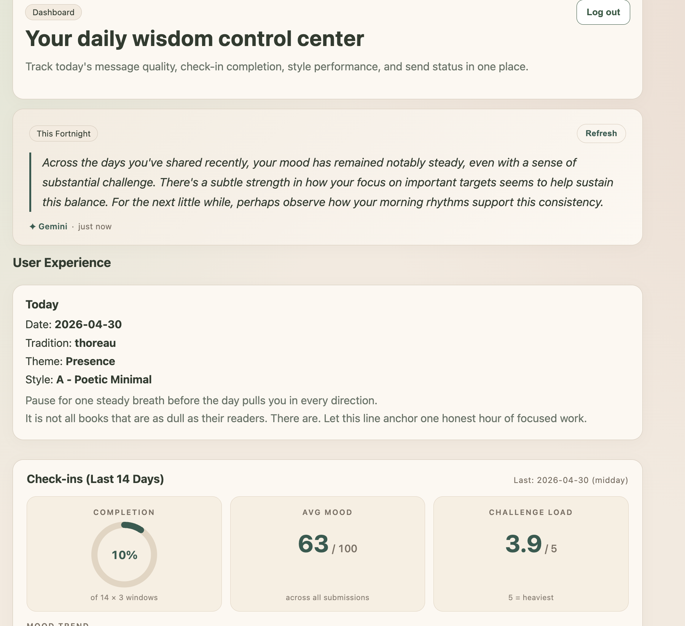
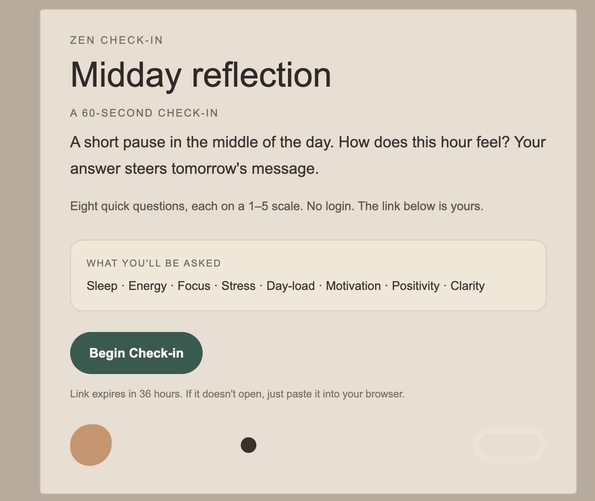
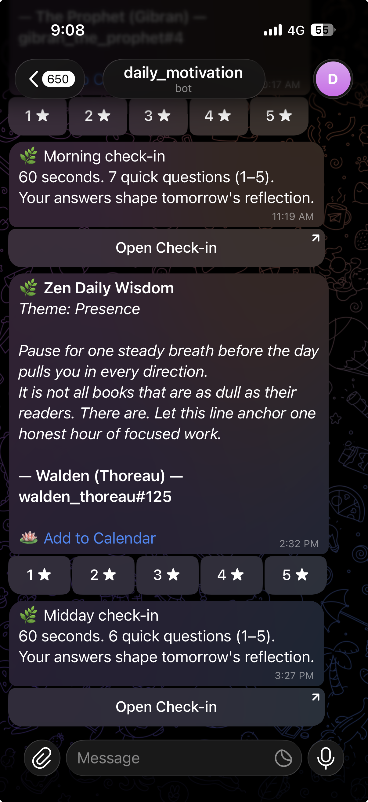

<div align="center">

# Zen Daily Wisdom

**A personal RAG service that delivers one short, grounded reflection per day — Stoic, Indian, Sufi, Zen, naturalist — to email and Telegram, tuned by your own mood check-ins.**

[](https://www.python.org)
[](https://fastapi.tiangolo.com)
[](https://nextjs.org)
[](https://www.typescriptlang.org)
[](https://supabase.com)
[](https://www.postgresql.org)
[](https://ai.google.dev)
[](https://tailwindcss.com)
[](https://recharts.org)
[](https://jupyter.org)
[](https://pytest.org)
[](https://vercel.com)
[](https://northflank.com)
[](#disclaimer)
[](#cost)

</div>

---

## What it is

A full-stack personal service combining **retrieval-augmented generation** over a hand-curated wisdom corpus, **time-aware EMA-style mood check-ins**, **Thompson-sampling personalization**, and beautifully styled multi-channel delivery — all on a strict $0/month free-tier budget.

- **Retrieval.** 4,606 public-domain passages from 13 traditions (Marcus Aurelius, Bhagavad Gita, Tao Te Ching, Thoreau, Rumi, Dhammapada, Aesop, etc.) chunked and embedded into pgvector.
- **Generation.** Gemini 2.5 Flash composes a 30–60 word reflection grounded in one retrieved passage, with a forbidden-phrase / cliché-rejection guard and a faithfulness check against the source.
- **Personalization.** A Thompson-sampling bandit over `(tradition, tone)` super-arms learns your taste from your own ratings; check-in answers (sleep, energy, focus, day-load, motivation, calm — questions that *vary by time of day*) feed a 0–100 weighted **Mood Score** that conditions retrieval.
- **Delivery.** Zen-styled HTML email (Gmail API), Telegram with inline rating buttons, and a public no-login check-in form opened from a signed deep link.
- **Eval.** Reproducible Jupyter notebooks for bandit convergence, corpus stats, RAG recall@k, and faithfulness — see [`EVALUATION.md`](EVALUATION.md).

---

## See it

<table>
  <tr>
    <td width="50%" valign="top">
      <p align="center"><b>Landing page</b><br/><sub>Vercel · public root</sub></p>
      
    </td>
    <td width="50%" valign="top">
      <p align="center"><b>Dashboard</b><br/><sub>14-day mood trend, animated stats, Gemini-written fortnight narrative</sub></p>
      
    </td>
  </tr>
  <tr>
    <td width="50%" valign="top">
      <p align="center"><b>Daily reflection email</b><br/><sub>One passage · one grounded reflection · 1–5 rating buttons</sub></p>
      
    </td>
    <td width="50%" valign="top">
      <p align="center"><b>Check-in reminder email</b><br/><sub>Window-tailored questions · signed no-login deep link</sub></p>
      
    </td>
  </tr>
  <tr>
    <td colspan="2" align="center">
      <p><b>Telegram delivery</b> — the same daily reflection plus check-in prompts, with inline rating buttons that update the bandit posterior in real time.</p>
      
    </td>
  </tr>
</table>

---

## Architecture

```
                  ┌───────────────────────────────────────────────────┐
                  │  GitHub Actions (cron)                            │
                  │  · daily.yml      01:30 UTC / 07:00 IST           │
                  │  · checkin-reminders.yml  3×/day IST              │
                  │  · keepalive.yml  every 3 days                    │
                  └───────────────┬───────────────────────────────────┘
                                  │ HMAC-signed POST
                                  ▼
       ┌──────────────────────────┴──────────────────────────┐
       │  FastAPI on Northflank — sandbox, always-on, $0     │
       │  ───────────────────────────────────────────────    │
       │  /internal/generate          /internal/checkin-…    │
       │  /checkin/by-token (public)  /feedback (HMAC link)  │
       │  /dashboard/* (Supabase JWT) /telegram/webhook      │
       └────┬──────────────┬──────────┬──────────┬───────────┘
            │              │          │          │
            ▼              ▼          ▼          ▼
   ┌────────────┐  ┌──────────────┐ ┌─────────┐ ┌──────────────┐
   │  pgvector  │  │ Gemini 2.5   │ │  Gmail  │ │   Telegram   │
   │ (Supabase) │  │ Flash + Emb. │ │   API   │ │    Bot API   │
   │ 4,606 rows │  │  free tier   │ │         │ │              │
   └─────┬──────┘  └──────┬───────┘ └─────────┘ └──────────────┘
         │                │
         │                └─── grounded reflection generation
         │                     + per-submit Gemini observation
         │                     + weekly fortnight narrative
         │
         └── Thompson-sampling bandit over (tradition, tone)
             updates `bandit_state` on each feedback insert (PG trigger)

                 Vercel — Next.js 15 dashboard + public /checkin form
```

**Key design decisions** are recorded as ADRs in [`IMPLEMENTATION_PLAN.md`](IMPLEMENTATION_PLAN.md) §20 — covering the choice of pgvector over Pinecone/Chroma, the two-tier corpus model, why Telegram instead of WhatsApp, the move from PIL image cards to text formatting, and the token-signed in-email check-in flow.

---

## Tech stack at a glance

| Layer | Choice | Why |
|---|---|---|
| Frontend | Next.js 15 (App Router) on Vercel | Hobby tier; React Server Components; no sleep |
| Frontend types | TypeScript 5 | Type safety on the client |
| Styling | Tailwind 4 + custom zen tokens | Fast iteration; one palette across email + UI |
| Charts | Recharts 3 | 14-day mood trend on the dashboard |
| Backend | FastAPI 0.115 (Python 3.12) on Northflank | Async; clean OpenAPI; sandbox always-on |
| Package mgr | `uv` (Python) · `pnpm` (JS) | Fast, lockfile-strict |
| DB / vectors | Supabase Postgres + pgvector | One service for rows, vectors, auth, RLS |
| LLM | Gemini 2.5 Flash + `text-embedding-004` | Generous free tier, 1M-token context |
| Email | Gmail API + Jinja2 templates | Free; multi-recipient; HMAC-signed rating links |
| Messaging | Telegram Bot API | Free, instant, inline keyboards for ratings |
| Calendar | Google Calendar API | Native subscription from iPhone + Mac |
| Scheduling | GitHub Actions cron | Free on private repos |
| Tests | Pytest (87 passing) + Vitest | Backend math + endpoints + frontend types |
| Eval | Jupyter notebooks + matplotlib | Bandit convergence, recall@k, corpus stats, faithfulness |

---

## Highlights

- **Zero recurring cost.** Gmail / Telegram / Calendar / Gemini / GitHub Actions / Vercel Hobby / Northflank Sandbox / Supabase free tier — every paid surface is explicitly avoided. See `IMPLEMENTATION_PLAN.md` §15.
- **Faithfulness-guarded RAG.** Every generated reflection is checked for token overlap with the retrieved passage and rejected on cliché openers (`"the passage…"`, `"this passage…"`) or known-bad phrases (`"you've got this"`, `"trust the journey"`, etc.).
- **Bandit math, not theatre.** Posteriors live in a `bandit_state` table and update via a PG trigger on each feedback insert. The notebook in [`notebooks/bandit_convergence.ipynb`](notebooks/bandit_convergence.ipynb) shows convergence to the optimal arm within ~150–200 rounds at the production ε = 0.15.
- **Time-tailored check-ins.** Morning, midday, and evening windows ask different questions (`sleep_quality` only matters in the morning; `tomorrow_clarity` only in the evening). 14-day weighted Mood Score on a 0–100 scale, with reverse-coded "challenge" items handled correctly. See `IMPLEMENTATION_PLAN.md` §12.5.
- **One-click check-ins.** A signed token in the reminder email opens a no-login form on Vercel; submission writes to Supabase and returns a Gemini observation + a related corpus passage in the same screen.
- **Hardened delivery.** Per-recipient Gmail send tolerates one bad address; localhost guard refuses to render broken URLs into outgoing email; bandit/Gemini failures degrade gracefully and never block the daily send.

---

## Evaluation

Reproducible numbers in [`EVALUATION.md`](EVALUATION.md), backed by four committed notebooks:

| Notebook | What it shows | Headline |
|---|---|---|
| [`bandit_convergence.ipynb`](notebooks/bandit_convergence.ipynb) | 30 seeds × 600 rounds × 3 regimes of synthetic Thompson sampling | Mean cumulative regret 47.1 (production) vs 124.8 (uniform baseline) |
| [`corpus_stats.ipynb`](notebooks/corpus_stats.ipynb) | Per-tradition counts, length buckets, theme coverage, super-arm viability | 4,606 passages · 13 traditions · 13 viable arms · 0 theme holes |
| [`rag_eval.ipynb`](notebooks/rag_eval.ipynb) | Recall@k over 30 hand-labeled queries pulled from `config/personal.yaml` stress themes | recall@5 = 0.767 (target ≥ 0.80; gap diagnosed in `EVALUATION.md` §3) |
| [`faithfulness.ipynb`](notebooks/faithfulness.ipynb) | Token-overlap of generated reflection vs source passage | Framework shipped; numbers fill in once `sent_history` accumulates ≥ 30 rows |

---

## Quick start

```bash
# Backend (FastAPI + pgvector)
source .venv/bin/activate
uv pip install -e "./apps/backend[dev]"
uvicorn zen_backend.main:app --app-dir apps/backend/src --reload --port 8000

# Frontend (Next.js)
corepack enable && corepack prepare pnpm@latest --activate
pnpm install
pnpm frontend:dev

# Smoke test
curl http://localhost:8000/health

# Apply Supabase migrations (after setting SUPABASE_DB_DSN)
python scripts/apply_supabase_migrations.py

# Seed the corpus from public-domain source files
python scripts/seed_passages_to_supabase.py --include-silver
python scripts/backfill_passage_embeddings.py

# Trigger a generation locally
python scripts/run_internal_generate.py --force
```

Required environment variables and one-time manual setup are documented in `MANUAL_ACTIONS_REQUIRED.md` (gitignored — not in this repo). High level:

- Supabase: project + service role key + DSN (use the **pooler** DSN locally; direct hosts are deprecated)
- Gemini: API key from a billing-disabled GCP project
- Gmail OAuth + Google Calendar OAuth refresh tokens
- Telegram bot token + webhook secret
- HMAC secrets for `INTERNAL_HMAC_SECRET`, `FEEDBACK_LINK_SECRET`, optional `CHECKIN_LINK_SECRET`

Northflank deployment guide: [`docs/NORTHFLANK_BACKEND_DEPLOY.md`](docs/NORTHFLANK_BACKEND_DEPLOY.md).

---

## Project structure

```
.
├── apps/
│   ├── backend/                 FastAPI · uv-managed · 87 tests passing
│   │   ├── src/zen_backend/
│   │   │   ├── routes/          /internal /checkin /feedback /dashboard /telegram
│   │   │   ├── services/        bandit · checkin_response · dashboard_narrative
│   │   │   │                    generator · gemini_client · gmail_client · telegram
│   │   │   ├── security/        hmac_sig · checkin_token · jwt_verify
│   │   │   ├── db/              client · pg_client · queries
│   │   │   └── templates/       email_zen.html.j2  email_checkin.html.j2
│   │   └── tests/               unit + endpoint integration tests
│   └── frontend/                Next.js 15 · App Router · TypeScript
│       ├── app/                 dashboard, /checkin, /login, /feedback/thanks
│       ├── components/          MoodLineChart · CompletionRing · WeeklyNarrative · …
│       └── middleware.ts        Supabase Auth + allowlist gate
├── infra/supabase/migrations/   001-006: schema · RLS · bandit trigger · check-ins · …
├── scripts/                     OAuth setup · seed corpus · embeddings · eval export
├── notebooks/                   bandit · corpus stats · rag eval · faithfulness
├── assets/
│   ├── corpus/gold/             13 PD source files (Walden, Tao Te Ching, …)
│   └── eval/                    rag_eval_queries.jsonl · gitignored snapshots
├── EVALUATION.md                Methodology + numbers + reproducibility
├── IMPLEMENTATION_PLAN.md       Single source of truth · ADRs · roadmap (gitignored)
└── README.md                    you are here
```

---

## Cost

| Service | Tier | Monthly cost |
|---|---|---|
| Vercel (Hobby) | static frontend, no functions on paid path | **$0** |
| Northflank (Sandbox) | one always-on backend service | **$0** |
| Supabase (Free) | Postgres + pgvector + Auth | **$0** |
| Gemini (Free) | 2.5 Flash + text-embedding-004 | **$0** |
| Gmail / Telegram / Google Calendar APIs | personal use | **$0** |
| GitHub Actions | private repo, ≤ 2,000 min/mo | **$0** |
| **Total** | | **$0 / month** |

Hard guards in code: the Gemini API key lives in a billing-**disabled** GCP project, `GEMINI_DAILY_CALL_CAP=20` is enforced in the client, and a 3-day Supabase keepalive cron prevents the project from auto-pausing.

---

## Disclaimer

This project is **built for personal use**. The dashboard is gated by an explicit email allowlist; magic-link / password authentication is restricted to a small set of accounts I control. The corpus is entirely **public-domain English** (or PD English translations) — see `IMPLEMENTATION_PLAN.md` §9 for source URLs and licenses.

If you'd like access, or to discuss any part of the architecture / evaluation / personalization design, please reach out.

**Author:** Rishabh Kumar
**Email:** [rishabhkumards07@gmail.com](mailto:rishabhkumards07@gmail.com)
